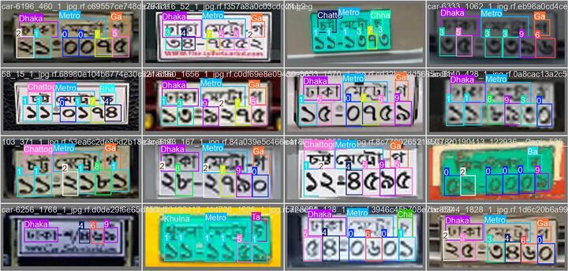
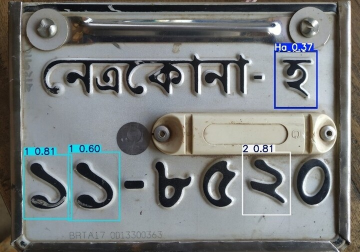
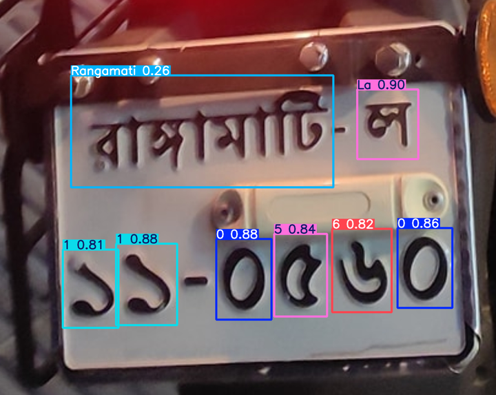
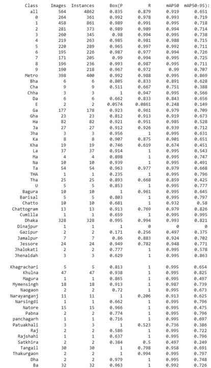
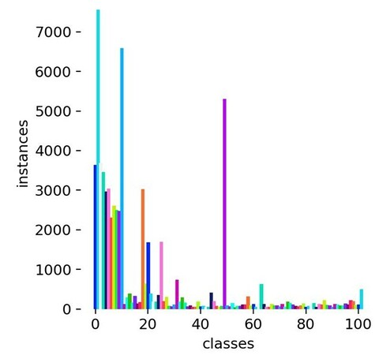
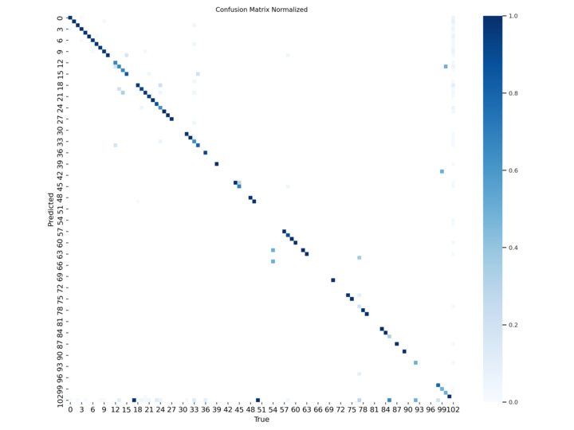
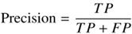
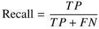
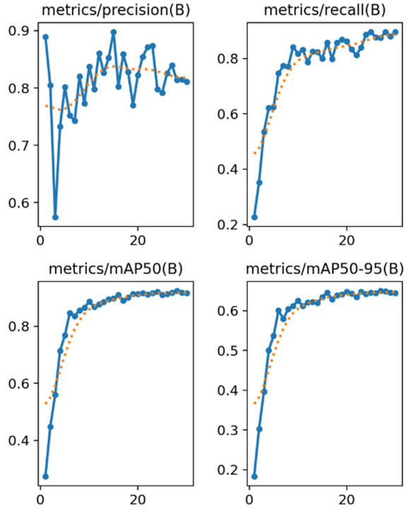
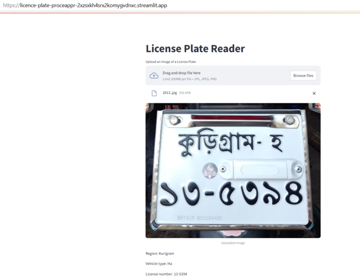

# licence-plate-processor
README – CAR PLATES PROJECT

OVERVIEW
This project predicts the license number of Bangladesh car plates.
The prediction model is based on YOLO from Ultralytics.
YOLO (You Only Look Once) is a real-time object detection algorithm that performs both classification and prediction of bounding boxes for detected objects using a single convolutional neural network.

YOLO Detection System
The model divides the image into an S x S grid and for each grid cell predicts bounding boxes, object classes and confidence.
For the calculation of the confidence, the YOLO model uses the Intersection over Union (IoU) that is the area of overlap between the predicted bounding box and the ground-truth bounding box.
YOLO can predict multiple objects per grid cell and use a non maximum supression method to choose the prediction with higher confidence.

ABOUT THE DATASET
The dataset used for this project is from Kaggle:
https://www.kaggle.com/datasets/mirzamahfujhossain/bangla-license-plate-dataset-with-annotations/data
The Bangla License Plate Dataset is a comprehensive collection of images featuring license plates from Bangladesh, annotated with text labels for 102 classes. 
The classes include digits 0-9, the word "Metro," and the Bengali alphabet characters: A, Bha, Cha, Chha, Da, DA, E, Ga, Gha, Ha, Ja, Jha, Ka, Kha, La, Ma, Na, Pa, Sa, Sha, Ta, THA, Tha, U, Bagerhat, Bagura, Bandarban, Barguna, Barisal, Bhola, Brahmanbaria, Chandpur, Chapainawabganj, Chatto, Chattogram, Chuadanga, Cox's Bazar, Cumilla, Dhaka, Dinajpur, Faridpur, Feni, Gaibandha, Gazipur, Gopalganj, Habiganj, Jamalpur, Jessore, Jhalokati, Jhenaidah, Joypurhat, Khagrachari, Khulna, Kishoreganj, Kurigram, Kustia, Lakshmipur, Lalmonirhat, Madaripur, Magura, Manikganj, Meherpur, Moulvibazar, Mymensingh, Naogaon, Narail, Narayanganj, Narsingdi, Natore, Netrokona, Nilphamari, Noakhali, Pabna, Panchagarh, Patuakhali, Pirojpur, Raj, Rajbari, Rajshahi, Rangamati, Rangpur, Satkhira, Shariatpur, Sherpur, Sirajganj, Sunamganj, Sylhet, Tangail, Thakurgaon, Dha, and Ba.

EXPLORATORY DATA ANALYSIS (EDA)

These are the conclusions after the Exploratory Data Analysis of the dataset:

Train images and train labels
-	The dataset has 12680 train images and 12680 label files.
-	The number of duplicate train images in the dataset is: 69.
-	The number of duplicate train labels in the dataset is: 7202.
-	The duplicate train images were eliminated.
-	Only the not duplicated train images and his correspondent train label were kept in the train folders.

Validation images and validation labels
-	There are no duplicate valid images in the dataset.

After the elimination of the duplicate train images, these are the numbers for the train, validation, test images and labels:

|Train images             |Train labels              |
|---------------          |---------------           |
|12.595                   |12.595                    |

|Validation images        |Validation labels         |
|---------------          |---------------           |
|564                      |564                       |	

|Test images              |Test labels               |
|---------------          |---------------           |	
|385                      |385                       |		

MODEL PREDICTION IMPLEMENTATION
The model used is YOLO version 8 nano with the tunning of two hyperparameters: 
-Epochs: each epoch represents a full pass over the entire dataset.
-Freeze: to freeze some YOLO layers when transfer learning. 
The recommendation to start is to freeze the layers of the backbone of the model and YOLO version 8 has 129 layers in total and 12 layers in the backbone.

The used values were:
-Epochs: 1, 2, 10, 20 ,30.
-Freeze: 12, 0.

The first execution of the YOLO model was with one epoch and the model did not predict all the characters of a car plate:

After some executions with different hyperparameters, the YOLO model with 30 epochs and freeze=0 could predict all the characters of a car plate with a good precision being MAP50 for all classes 0.919 and MAP50-95 for all classes 0.651.

METRICS
This is the summary of the metrics for the chosen Yolov8n, 30 epochs, freeze=0 model:

Validation metrics

Instances per Class

 

As also seen in the Validation metrics table, the dataset is unbalanced because there are some classes with many instances, for example the numbers “0 to 9”, but there are some characters that appears very few times in the dataset, for example the letter “E” (class 17).

Confusion Matrix Normalized

 

The Confusion Matrix Normalized also shows that the dataset is unbalanced because the numbers “0 to 9” have many instances and a good model performance but some letters, like “E” (class 17), have very few instances and a very low model performance.

Precision, Recall, MAP50, MAP50-95

Precision: the ratio of correctly identified positive instances to the total predicted positive instances.

 
       

Recall: The true positive rate that were classified correctly as positives.

       

mAP50: Mean average precision calculated at an intersection over union (IoU) threshold of 0.50.

mAP50-95: The average of the mean average precision calculated at varying IoU thresholds, ranging from 0.50 to 0.95.

API AND WEB APPLICATION
-	API: The API was developed using FastAPI, and it was deployed online using Render for hosting and management. 
-	Web Application: The web application was created using Streamlit, which provided an efficient framework for building and deploying the app.

CHALLENGES IDENTIFIED

1)	The dataset had a lot of duplicated train images and duplicated labels and the duplicate images were removed from the train images folder. 
2) For the model prediction, we started to work on Visual Studio Code in local but the 
YOLO model needed a lot of processing capacity and we had to make the code on 
Google Colab and use a GPU in Colab with Google Colab Pro.
3) As the dataset has a lot of images and it is heavy (2,61 GB), to load the dataset we 
use two options:
Option 1: download the dataset from Kaggle using the Kaggle credentials (Kaggle 
username and Kaggle key).
Option 2: firstly, uploading the dataset to Google Drive and then, loading the 
dataset from Google Drive using drive.mount function.
4) The results of the model prediction provides the class results sorted by confidence 
score and before the presentation of the results in the web page, we had to sorted 
the class results taking into account the real order of the characters in the car plate.
